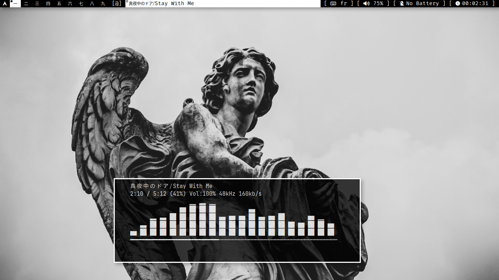

  <h1>My DWM Rice</h1>

  
📷 Preview (click to expand)

   
  
  
  

  
🎥 Video Preview (click to expand)

   
  <video src="video.mp4" controls width="600"></video>

---

<h2>✨ Features</h2>

- Better fullscreen  
- Floating window centering  
- Smooth Picom animations  
- Transparency  
- ST + Kitty image protocol  
- Scrollback support  
- Minimal RAM usage  
- Nice Dmenu app launcher  
- VanityGaps  
- Tile Move  
- Fastfetch rice  
- Full Neovim configuration (LSP, remaps, theme, plugins)  
- Picom configuration  
- 19 patches  

---

## ⌨️ Keybindings

| Keybinding                  | Action                                  |
|-----------------------------|------------------------------------------|
| `Alt + Shift + Enter`       | Open terminal                           |
| `Alt + p`                   | Open dmenu                             |
| `PrtSc`                     | Screenshot                             |
| `Alt + Shift + c`           | Close window                           |
| `Alt + Shift + q`           | Restart & logout                       |
| `Alt + Shift + Ctrl + q`    | Restart without logout                  |
| `Alt + b`                   | Toggle bar                             |
| `Alt + t`                   | Set windows to tiling                  |
| `Alt + m`                   | Spiral layout                          |
| `Alt + f`                   | Fullscreen                             |
| `F11`                       | Real fullscreen                        |
| `Alt + h / Alt + l`         | Resize window left / right              |
| `Alt + j / Alt + k`         | Focus next / previous window            |
| `Alt + 1..9`                | Switch to workspace 1–9                |
| `Alt + Shift + 1..9`        | Move window to workspace 1–9           |
| `Alt + Shift + j / k`       | Move window position                   |
| `Alt + i`                   | Vertical stack layout                  |
| `Alt + Mouse1`              | Move window with mouse (floating)      |
| `Alt + Mouse2`              | Resize & float window with mouse       |
