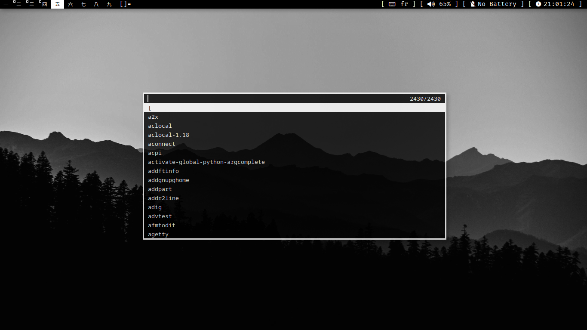
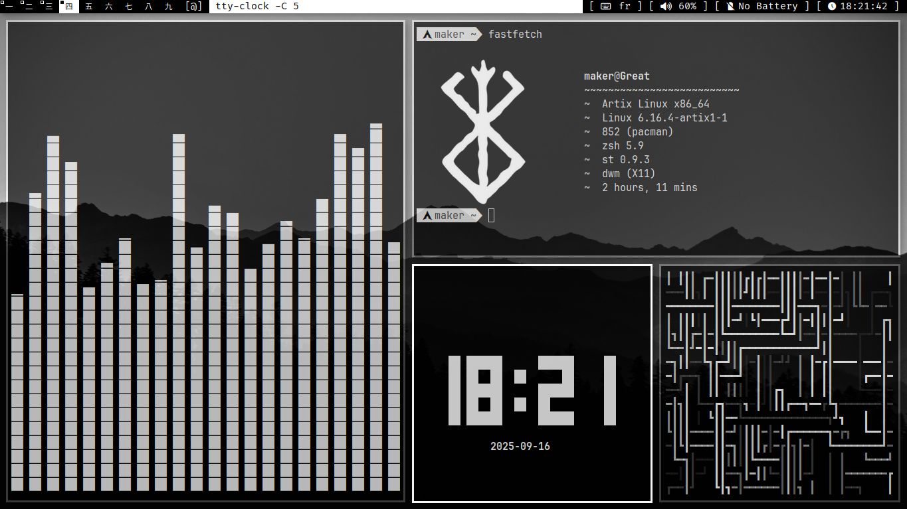

<h1>My DWM Rice</h1>

<h2>DWM</h2>

- Better fullscreen
- Floating window centering
- Picom Animations Smooth
- transparency
- st kitty image protocol
- scrollback
- minimal RAM usage
- Nice Dmenu app luncher
- VanityGaps
- Tile Move
- Fastfetch rice
- Full Neovim configuration with LSP, remaps, theme and plugins
- Picom configuration
- 19 Patch

## Keybindings

| Keybinding                  | Action                                  |
|-----------------------------|------------------------------------------|
| `Alt + Shift + Enter`       | Open terminal                           |
| `Alt + p`                   | Open dmenu                             |
| `PrtSc`                     | Screenshot                             |
| `Alt + Shift + c`           | Close window                           |
| `Alt + Shift + q`           | Restart & logout                       |
| `Alt + Shift + Ctrl + q`    | Restart without logout                  |
| `Alt + b`                   | Toggle bar                             |
| `Alt + t`                   | Set windows to tiling                  |
| `Alt + m`                   | Spiral layout                          |
| `Alt + f`                   | Fullscreen                             |
| `F11`                       | Real fullscreen                        |
| `Alt + h / Alt + l`         | Resize window left / right              |
| `Alt + j / Alt + k`         | Focus next / previous window            |
| `Alt + 1..9`                | Switch to workspace 1–9                |
| `Alt + Shift + 1..9`        | Move window to workspace 1–9           |
| `Alt + Shift + j / k`       | Move window position                   |
| `Alt + i`                   | Vertical stack layout                  |
| `Alt + Mouse1`              | Move window with mouse (floating)      |
| `Alt + Mouse2`              | Resize & float window with mouse       |
